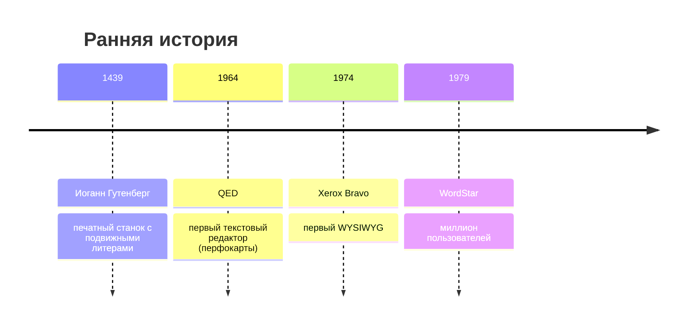
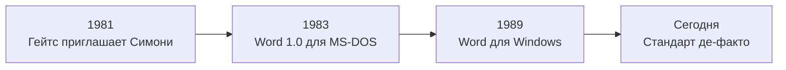
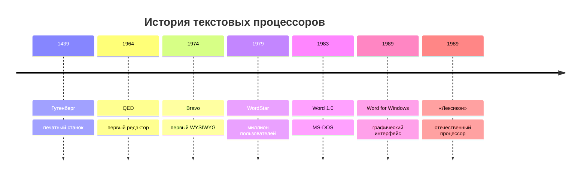
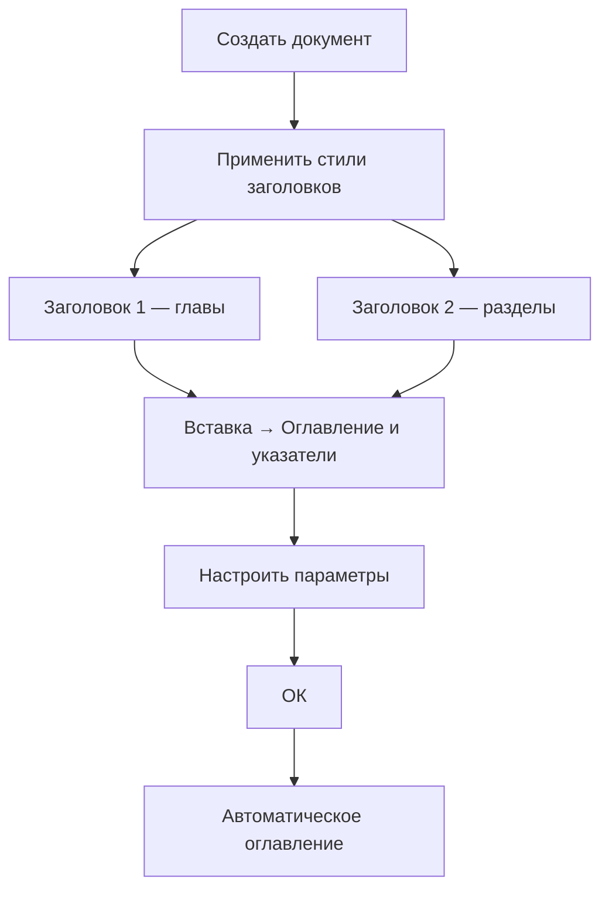

# Текстовые процессоры

## От Гутенберга до облаков

### История, виды, функции и настройка интерфейса

<div class="pt-8 text-sm opacity-70">
Лектор: Гордин Дмитрий · Дата: 26.09.2026
</div>

<div class="pt-6 text-xs opacity-50">
Блок 1 — История и общий обзор · Блок 2 — Практика LibreOffice Writer
</div>

<!--
СПИКЕР: Приветствие. Объявляем структуру: сначала история и теория, затем конкретика по LibreOffice Writer. Настраиваем на 2 часа работы.
-->

---
layout: section
---

# БЛОК 1

## История и общий обзор

От печатного станка до облачных редакторов

<!--
СПИКЕР: Разделитель. Объясняем, что без понимания истории не будет понимания, зачем нужны современные функции.
-->

---

# О чём эта лекция?

<div class="grid grid-cols-2 gap-6 text-left">

<div>

### 🎯 Что разберём

- Пройдём путь от перфокарт до Google Docs
- Разберёмся, чем **редактор** отличается от **процессора**
- Научимся настраивать интерфейс под себя
- Ответим на вопрос: как работать **быстрее** и **удобнее**?

</div>

<div class="flex items-center justify-center text-6xl">

🖨️ → 📇 → 💾 → ☁️

</div>

</div>

<!--
СПИКЕР: Задайте вопрос аудитории: «Кто пользовался Word? Google Docs? Блокнотом?» Поднимите руки. Покажите, что все уже пользователи, но не все знают историю и скрытые возможности.
-->

---

# От Гутенберга до первых редакторов



**Проблема перфокарт:** изменение одной буквы требовало перебора всего набора.

<!--
СПИКЕР: Подчеркните: Гутенберг — это революция тиражирования, но каждая правка требовала нового набора. Перфокарты — шаг назад по удобству, но шаг вперёд по автоматизации.
-->

---

# 1974: Что видишь, то и получаешь

<div class="grid grid-cols-2 gap-4">

<div>

### Xerox Bravo

- **Чарльз Симони** и **Батлер Лэмпсон**
- Создан для **Xerox Alto**
- Первый режим **WYSIWYG**
- Текст на экране = текст на бумаге

</div>

<div class="p-4 bg-orange-50 rounded">

### ❗ Исторический факт

Xerox **не оценил** потенциал — Alto не стал коммерческим продуктом.

Позже Симони ушёл в Microsoft и создал Word.

</div>

</div>

<!--
СПИКЕР: Это пример того, как компания может упустить революцию. Xerox подарила миру идею, а заработали другие.
-->

---

# 1979: Миллион пользователей

<div class="grid grid-cols-2 gap-4">

<div>

### WordStar

- Создатели: **Сеймур Рубинштейн**, **Роб Барнэби**
- Платформы: CP/M, MS-DOS
- «Магические» комбинации: **Ctrl+K**, **Ctrl+Q**

</div>

<div>

### ➕ Плюсы и ➖ минусы

| ➕ | ➖ |
|---|---|
| Скорость работы | Сложность для новичков |
| Работа без мыши | Запоминание комбинаций |

</div>

</div>

<!--
СПИКЕР: Спросите: «Кто-нибудь пробовал работать в редакторах без мыши?» WordStar — пример того, как скорость достигается за счёт кривой обучения.
-->

---

# Microsoft Word: от неудачи к короне



**1989 — Word для Windows:** графический интерфейс, мышь, WYSIWYG.

<!--
СПИКЕР: Обратите внимание: Word 1.0 был неудачным. Успех пришёл с Windows. Это урок: технология должна совпасть с платформой.
-->

---

# Отечественный ответ: «Лексикон»

<div class="grid grid-cols-2 gap-4">

<div>

### «Лексикон»

- Конец 1980-х — **Евгений Веселов**
- Установлен на **95%** российских ПК
- Последняя версия для DOS — **1.4 (1993)**
- Версии для Windows не смогли конкурировать с Word

</div>

<div class="p-4 bg-yellow-50 rounded">

### 🇷🇺 Значение

Первый массовый отечественный текстовый процессор. С него началась компьютерная грамотность в России.

</div>

</div>

<!--
СПИКЕР: Для российской аудитории это важный слайд. «Лексикон» — это то, с чего начинали ваши родители. Можно спросить: «Кто слышал о «Лексиконе» от старших?»
-->

---

# Ключевые вехи: таймлайн



<!--
СПИКЕР: Пробегитесь по таймлайну, акцентируя переходы: «механика → перфокарты → экран → графика».
-->

---
layout: section
---

# Современные виды процессоров

## Настольные, облачные, специализированные

<!--
СПИКЕР: Переход к современности. Теперь у нас не один процессор, а целая экосистема под разные задачи.
-->

---

# Классические настольные процессоры

<div class="grid grid-cols-2 gap-4 text-sm">

<div class="p-3 border rounded">

### 🏢 Microsoft Word

Лидер рынка, Microsoft 365, максимальная совместимость.

</div>

<div class="p-3 border rounded">

### 🆓 LibreOffice Writer

Бесплатный, open-source, кроссплатформенный.

</div>

<div class="p-3 border rounded">

### 🪶 AbiWord

Лёгкий, для слабых ПК.

</div>

<div class="p-3 border rounded">

### 🇷🇺 «МойОфис Текст»

Российский, для госсектора.

</div>

</div>

<!--
СПИКЕР: Мы будем работать в LibreOffice Writer — он бесплатный, доступен всем, и на нём легко освоить принципы, которые работают в любом процессоре.
-->

---

# Облачные процессоры

<div class="grid grid-cols-2 gap-4">

<div>

### ☁️ Преимущества

- Доступ отовсюду
- Автосохранение
- Совместное редактирование в реальном времени
- История версий

</div>

<div>

### 🌐 Примеры

- **Google Docs**
- **Word для веба**
- **Zoho Writer**

</div>

</div>

> **Минус:** требуется интернет и аккаунт. Конфиденциальность под вопросом.

<!--
СПИКЕР: Спросите: «Кто работал в Google Docs одновременно с кем-то?» Обсудите, как это меняет командную работу.
-->

---

# Специализированные редакторы

<div class="grid grid-cols-3 gap-3 text-sm">

<div class="p-3 border rounded">

### 📐 ChiWriter

Научные формулы (1990-е).

</div>

<div class="p-3 border rounded">

### 📝 Markdown-редакторы

Typora, Obsidian — для блогеров и программистов.

</div>

<div class="p-3 border rounded">

### 🪟 Блокнот / WordPad

Простейшие в Windows.

</div>

</div>

**Пример Markdown:**

```markdown
# Заголовок
**жирный** и *курсив*
- список
```

<!--
СПИКЕР: Markdown — это язык разметки, который сейчас набирает популярность. Obsidian, в котором вы работаете, — тоже Markdown-редактор.
-->

---

# Что выбрать? Сравнительная таблица

| Задача | Инструмент |
|---|---|
| Верстка книги | Word, Writer |
| Командная работа | Google Docs |
| Быстрые заметки | Markdown-редактор |
| Слабый ПК | AbiWord |
| Госсектор | МойОфис |
| Бесплатно + мощно | **LibreOffice Writer** |

<!--
СПИКЕР: Подчеркните последнюю строку — это наш выбор на сегодня.
-->

---
layout: section
---

# Часть 3. Понятие и функции

## Редактор vs Процессор

<!--
СПИКЕР: Ключевой теоретический блок. Именно здесь студенты должны чётко усвоить разницу.
-->

---

# Редактор vs Процессор

<div class="grid grid-cols-2 gap-6">

<div class="p-4 bg-blue-50 rounded">

### 📝 Текстовый редактор

- Работает с **простым текстом**
- Нет форматирования
- Пример: **Блокнот** (Notepad)

</div>

<div class="p-4 bg-green-50 rounded">

### 📄 Текстовый процессор

- Создание, редактирование, **форматирование**
- Сохранение, печать
- Пример: **LibreOffice Writer**

</div>

</div>

> **Ключевое отличие:** широкие возможности форматирования и работа с объектами.

<!--
СПИКЕР: Покажите на экране Блокнот и Writer рядом. Сразу видно разницу.
-->

---

# Функции (1): Работа с файлами и редактирование

<div class="grid grid-cols-2 gap-4 text-sm">

<div>

### 📁 Работа с файлами

- Создание, открытие, сохранение
- Форматы: `.docx`, `.odt`, `.rtf`, `.pdf`
- Печать
- Экспорт

</div>

<div>

### ✏️ Редактирование

- Ввод, удаление, замена
- Перемещение
- Копирование / вырезание / вставка
- Поиск и замена (Ctrl+H / Cmd+H)
- Undo / Redo (Ctrl+Z / Cmd+Z)

</div>

</div>

<!--
СПИКЕР: Продемонстрируйте Ctrl+H — поиск и замена. Это одна из самых недооценённых функций.
-->

---

# Функции (2): Форматирование

<div class="grid grid-cols-3 gap-3 text-sm">

<div class="p-3 border rounded">

### 🔤 Символы

- Шрифт (Font)
- Размер (Size)
- Начертание (Bold/Italic)
- Цвет (Color)

</div>

<div class="p-3 border rounded">

### ¶ Абзацы

- Выравнивание (Alignment)
- Отступы (Indents)
- Интервалы (Spacing)

</div>

<div class="p-3 border rounded">

### 📄 Страницы

- Поля (Margins)
- Ориентация (Orientation)
- Колонтитулы (Headers/Footers)

</div>

</div>

> **Стили** (Styles) — наборы параметров форматирования, применяемые одним щелчком.

<!--
СПИКЕР: Объясните, что ручное форматирование — путь в ад. Стили — спасение.
-->

---

# Функции (3): Объекты и сервис

<div class="grid grid-cols-2 gap-4 text-sm">

<div>

### 📊 Объекты

- Таблицы (Tables)
- Изображения (Images)
- Диаграммы (Charts)
- Формулы (Formulas)
- Гиперссылки (Hyperlinks)
- Сноски (Footnotes)

</div>

<div>

### ⚙️ Сервис

- Проверка орфографии (Spellcheck)
- Автозамена (AutoCorrect)
- Статистика (Word Count)
- Защита паролем (Password)
- Совместная работа (Collaboration)

</div>

</div>

<!--
СПИКЕР: Скажите: «Проверка орфографии — это не роскошь, а необходимость». Покажите, как включить.
-->

---

# 🤔 Вопрос аудитории

## Самая недооценённая функция текстового процессора?

<div class="pt-12">

<v-click>

# 💡 Ответ: **Стили**

Большинство форматирует вручную, а потом мучается при изменении.

</v-click>

</div>

<!--
СПИКЕР: Дайте аудитории 30 секунд подумать. Выслушайте варианты. Затем откройте ответ. Объясните: «Если вы отформатировали 100 заголовков вручную, а потом решили поменять шрифт — придётся переделывать всё. Со стилями — одно изменение».
-->

---
layout: section
---

# Часть 4. Возможности

## Обзор ключевых инструментов

<!--
СПИКЕР: Переход от теории к практике. Сейчас покажем, что умеет современный процессор.
-->

---

# Обзор возможностей

<div class="grid grid-cols-2 gap-4 text-sm">

<div class="p-3 border rounded">

### 📝 Текстовые

- Списки (Lists)
- Таблицы (Tables)
- Колонки (Columns)
- Буквица (Drop Cap)

</div>

<div class="p-3 border rounded">

### 🎨 Графические

- Изображения (Images)
- Фигуры (Shapes)
- SmartArt / Диаграммы

</div>

<div class="p-3 border rounded">

### 🤖 Автоматизация

- Шаблоны (Templates)
- Макросы (Macros)
- Поля (Fields)

</div>

<div class="p-3 border rounded">

### 🔒 Безопасность и совместная работа

- Пароли (Passwords)
- Цифровая подпись (Digital Signature)
- Комментарии (Comments)
- Отслеживание (Track Changes)

</div>

</div>

<!--
СПИКЕР: Пробегитесь по возможностям. Скажите: «Мы не будем изучать всё сегодня, но вы должны знать, что это есть».
-->

---
layout: section
---

# Часть 5. Настройка интерфейса

## Общие принципы (на примере Word и Writer)

<!--
СПИКЕР: Важный момент: принципы настройки одинаковы во всех процессорах. Названия могут отличаться.
-->

---

# Настройка ленты / панелей

<div class="grid grid-cols-2 gap-4">

<div>

### Microsoft Word

- **Файл → Параметры → Настроить ленту** (File → Options → Customize Ribbon)
- Создание своей вкладки: «Мои инструменты»
- Добавление групп и команд

</div>

<div>

### LibreOffice Writer

- **Сервис → Настроить** (Tools → Customize)
- Вкладка **Панели инструментов** (Toolbars)
- Добавление / удаление команд

</div>

</div>

> **Принцип:** не бойтесь удалять лишнее. Настройки можно сбросить.

<!--
СПИКЕР: Покажите оба диалога. Скажите, что в Writer можно даже импортировать свои иконки.
-->

---

# Панель быстрого доступа

<div class="grid grid-cols-2 gap-4">

<div>

### 📌 Что это

Панель в левом верхнем углу окна.

**По умолчанию:**
- Сохранить (Save)
- Отменить (Undo)
- Повторить (Redo)

</div>

<div>

### ➕ Что добавить

- Печать (Print)
- Вставить таблицу (Insert Table)
- Вставить формулу (Insert Formula)
- Экспорт в PDF (Export to PDF)

</div>

</div>

**Как настроить:** стрелка вниз → выбрать команды.

<!--
СПИКЕР: Покажите на своём экране, как за 10 секунд добавить кнопку «Экспорт в PDF». Это самая частая операция.
-->

---

# Горячие клавиши

<div class="grid grid-cols-2 gap-4">

<div>

### 🎯 Зачем

- Скорость работы
- Меньше движения мышью
- Профессиональная привычка

</div>

<div>

### ⚙️ Как настроить

- Word: **Файл → Параметры → Настроить ленту → Настройка клавиатуры**
- Writer: **Сервис → Настроить → Клавиатура**

</div>

</div>

> **Пример:** Ctrl+Alt+F — вставить формулу. Ctrl+Shift+P — надстрочный знак.

<!--
СПИКЕР: Назовите 5 самых полезных: Ctrl+S, Ctrl+Z, Ctrl+F, Ctrl+H, Ctrl+B. Попросите записать.
-->

---

# Режим фокусировки и темы

<div class="grid grid-cols-2 gap-4 text-sm">

<div class="p-3 border rounded">

### 🧘 Focus Mode

- Word: **Вид → Фокус** (View → Focus)
- Writer: **Вид → Полноэкранный режим** (View → Full Screen)
- Убирает всё лишнее

</div>

<div class="p-3 border rounded">

### 🎨 Темы и язык

- Цветовая схема: **Файл → Параметры → Общие**
- Язык интерфейса: **Файл → Параметры → Язык**
- Тёмная тема для комфорта

</div>

</div>

> **Совет:** Свернуть ленту — **Ctrl+F1**. Работает и в Word, и в Writer.

<!--
СПИКЕР: Покажите Focus Mode. Скажите: «Попробуйте написать хотя бы абзац в этом режиме — вы удивитесь, насколько легче».
-->

---

# Практическое задание (в аудитории)

## Настройте под себя

<div class="text-left text-sm">

1. Создайте вкладку **«Мои инструменты»** (или панель в Writer).
2. Добавьте: **Вставить таблицу**, **Вставить формулу**, **Проверка орфографии**.
3. Добавьте на панель быстрого доступа **«Предварительный просмотр»**.
4. Назначьте горячую клавишу для **«Вставить сноску»**.
5. Включите **режим фокусировки**.

</div>

<!--
СПИКЕР: Дайте 5 минут. Пройдите по рядам, помогите. Затем обсудите, у кого что получилось.
-->

---

# Советы по настройке

<div class="grid grid-cols-2 gap-4 text-sm">

<div>

### ✅ Делайте

- Начните с малого: одна кнопка → вторая
- Используйте шаблоны для однотипных документов
- Изучите горячие клавиши
- Синхронизируйте настройки (в Microsoft 365)

</div>

<div>

### ❌ Не делайте

- Не бойтесь экспериментировать — настройки сбросятся
- Не пытайтесь настроить всё сразу
- Не игнорируйте Ctrl+S
- Не форматируйте вручную там, где нужны стили

</div>

</div>

<!--
СПИКЕР: Подчеркните: «Настройка — это инвестиция времени, которая окупается в первый же день».
-->

---

# Главная мысль блока 1

<div class="text-2xl pt-8">

Текстовый процессор — это **не печатная машинка**.

Это **среда** для создания, оформления и распространения информации.

</div>

<!--
СПИКЕР: Пауза. Дайте фразе осесть. Затем переход ко второму блоку.
-->

---
layout: section
---

# БЛОК 2

## Практика: LibreOffice Writer

Понятие, функции, возможности, настройка интерфейса

<!--
СПИКЕР: Теперь переходим от общих принципов к конкретному инструменту. Всё, что мы обсуждали, реализуем в Writer.
-->

---

# LibreOffice Writer: место среди процессоров

<div class="grid grid-cols-2 gap-4">

<div>

### 🆓 Свободный

- Open-source
- Бесплатный
- Кроссплатформенный (Windows, macOS, Linux)

</div>

<div>

### 💪 Мощный

- Стили и шаблоны
- Автооглавление
- Работа с большими документами
- Экспорт в PDF, EPUB

</div>

</div>

> **Формат по умолчанию:** ODF (`.odt`). Для совместимости с Word — `.docx`.

<!--
СПИКЕР: Подчеркните: «Writer — это не "урезанный Word". Это полноценный инструмент, который многие недооценивают».
-->

---

# Главное окно Writer

<!--  -->

**Описание скриншота:** Стандартный интерфейс LibreOffice Writer:
- **Строка заголовка** (Title Bar) — имя документа
- **Строка меню** (Menu Bar) — Файл (File), Правка (Edit), Вид (View), Вставка (Insert), Формат (Format), Таблица (Table), Сервис (Tools), Окно (Window), Справка (Help)
- **Стандартная панель** (Standard Toolbar) — создание, открытие, сохранение, экспорт PDF
- **Панель форматирования** (Formatting Toolbar) — шрифт, размер, выравнивание
- **Линейка** (Ruler) — горизонтальная и вертикальная
- **Рабочая область** (Document Area)
- **Строка состояния** (Status Bar) — страница, слова, язык

<!--
СПИКЕР: Покажите на экране каждый элемент. Попросите студентов найти их у себя.
-->

---

# Выбор варианта интерфейса

<!--  -->

**Описание скриншота:** Диалог **Вид → Пользовательский интерфейс** (View → User Interface):
- Левая панель: **Standard Toolbar**, **Tabbed**, **Tabbed Compact**, **Groupedbar Compact**, **Contextual Single**, **Single Toolbar**, **Sidebar**
- Правая часть: предпросмотр
- Кнопки: **Применить к Writer** (Apply to Writer) / **Применить ко всем** (Apply to All)

<!--
СПИКЕР: Скажите: «Если вы переходите с Word — выбирайте Tabbed Compact. Привыкнете за 5 минут».
-->

---

# Tabbed Compact

<!--  -->

**Описание скриншота:** Интерфейс Tabbed Compact:
- Вкладки: **Файл**, **Главная**, **Вставка**, **Макет**, **Ссылки**, **Рецензирование**, **Вид** (File, Home, Insert, Layout, References, Review, View)
- Строка меню скрыта
- Сходство с Ribbon в MS Office
- Экономия вертикального пространства

<!--
СПИКЕР: Переключите на этот режим и покажите разницу. Спросите: «Кому удобнее так?»
-->

---

# Боковая панель (Sidebar)

<!--  -->

**Описание скриншота:** Боковая панель Writer:
- Активация: **Вид → Боковая панель** (View → Sidebar) или **Ctrl+F5**
- Панели: **Свойства** (Properties), **Стили** (Styles), **Галерея** (Gallery), **Навигатор** (Navigator)
- **Свойства:** шрифт, цвет, выравнивание, отступы
- **Стили:** список стилей абзацев, символов, страниц

<!--
СПИКЕР: Покажите, как за 3 секунды изменить шрифт через боковую панель. Это быстрее, чем через меню.
-->

---

# Настройка панелей инструментов

<!--  -->

**Описание скриншота:** Диалог **Сервис → Настроить** (Tools → Customize):
- Вкладка **Панели инструментов** (Toolbars)
- Левая панель: доступные команды
- Правая панель: назначенные команды
- Кнопки: **Добавить** (Add), **Удалить** (Remove), **Изменить** (Modify)
- Можно сменить значок: **Изменить → Сменить значок** (Modify → Change Icon)

<!--
СПИКЕР: Продемонстрируйте добавление кнопки «Экспорт в PDF». Скажите: «Это экономит 5 секунд каждый раз. За день — минуты».
-->

---

# Параметры Writer

<!--  -->

**Описание скриншота:** Диалог **Сервис → Параметры** (Tools → Options):
- **LibreOffice → Вид** (View): тема, размер значков
- **Загрузка/Сохранение** (Load/Save): форматы по умолчанию
- **Настройки языка** (Language Settings): язык, проверка орфографии
- **Writer → Форматирование** (Formatting Aids): отображение непечатаемых символов

<!--
СПИКЕР: Рекомендуйте включить отображение непечатаемых символов (¶) — это помогает контролировать структуру.
-->

---

# Практический пример: автооглавление



> **Обновление:** правый клик на оглавлении → **Обновить** (Update).

<!--
СПИКЕР: Продемонстрируйте на заранее подготовленном документе. Скажите: «Это то, что сэкономит вам часы при написании курсовой».
-->

---

# Ключевые выводы (оба блока)

<div class="grid grid-cols-2 gap-4 text-sm">

<div>

### 📌 Блок 1

1. История: от Гутенберга до облаков
2. Редактор ≠ процессор
3. Функции: файлы, редактирование, форматирование, объекты
4. Стили — самая недооценённая функция
5. Настройка интерфейса — инвестиция времени

</div>

<div>

### 📌 Блок 2

1. Writer — бесплатный аналог Word
2. Интерфейс гибко настраивается
3. Tabbed Compact — для пользователей Word
4. Боковая панель (Ctrl+F5) — быстрый доступ
5. Автооглавление — must-have

</div>

</div>

<!--
СПИКЕР: Пробегитесь по выводам. Подчеркните связь между блоками.
-->

---

# Домашнее задание

<div class="text-left text-sm">

**9 вариантов** (см. файл `homework/09-variants.md`):

1. Документ с автооглавлением
2. Настройка Tabbed Compact
3. Таблица с вычислениями
4. Изображение с обтеканием
5. Колонтитулы и нумерация
6. Стили для курсовой
7. Шаблон делового письма
8. Настройка панели инструментов
9. Сравнение интерфейсов

</div>

<!--
СПИКЕР: Разошлите варианты в чат. Скажите: «Каждый делает свой вариант. Сдача — к следующему занятию».
-->

---
layout: center
class: text-center
---

# Спасибо за внимание!

## Вопросы?

<div class="pt-12 text-sm opacity-60">
Лекция: «Текстовые процессоры: от Гутенберга до LibreOffice Writer»
</div>

<!--
СПИКЕР: Поблагодарите. Откройте обсуждение. Напомните про домашнее задание.
-->
