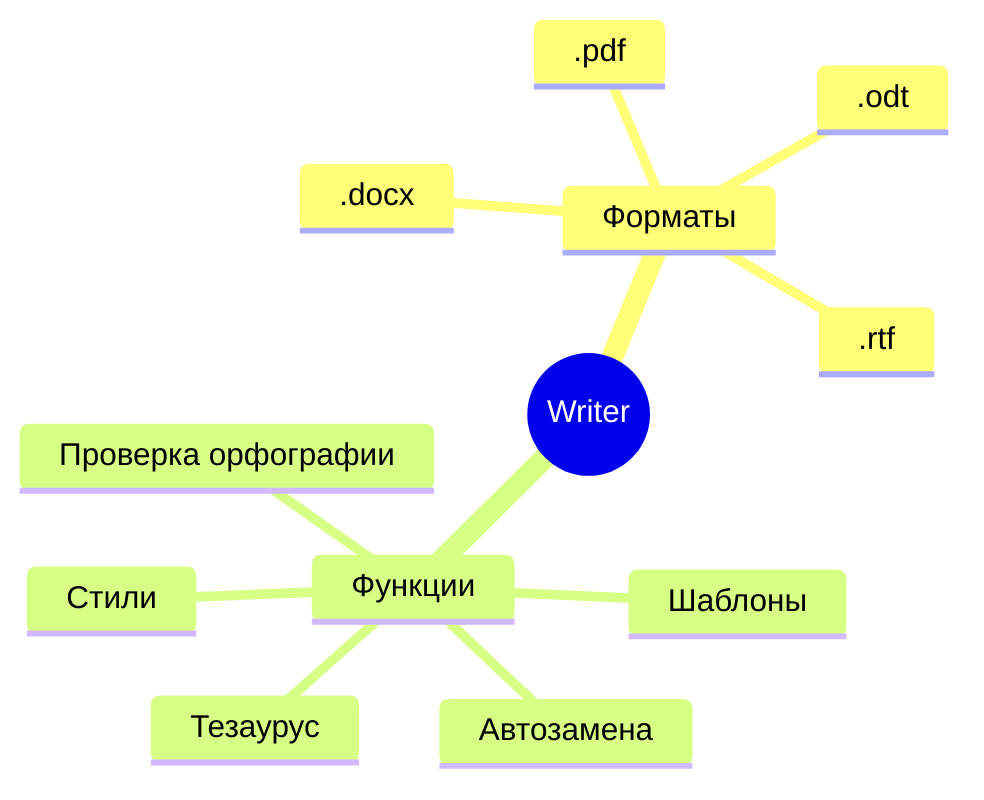
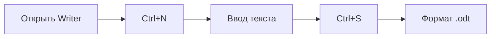
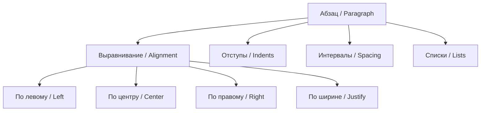
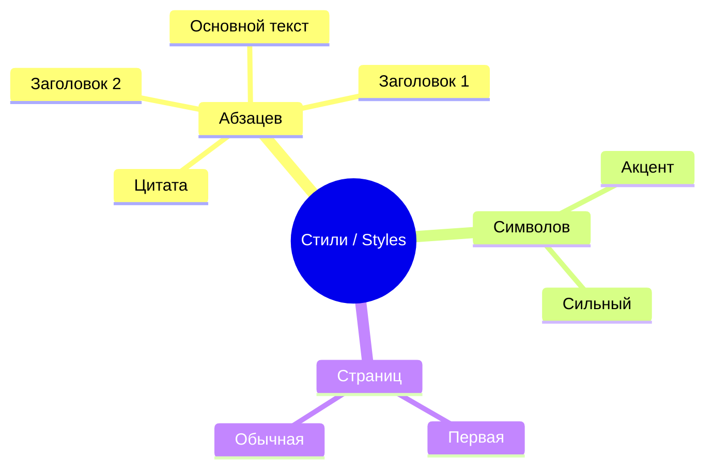
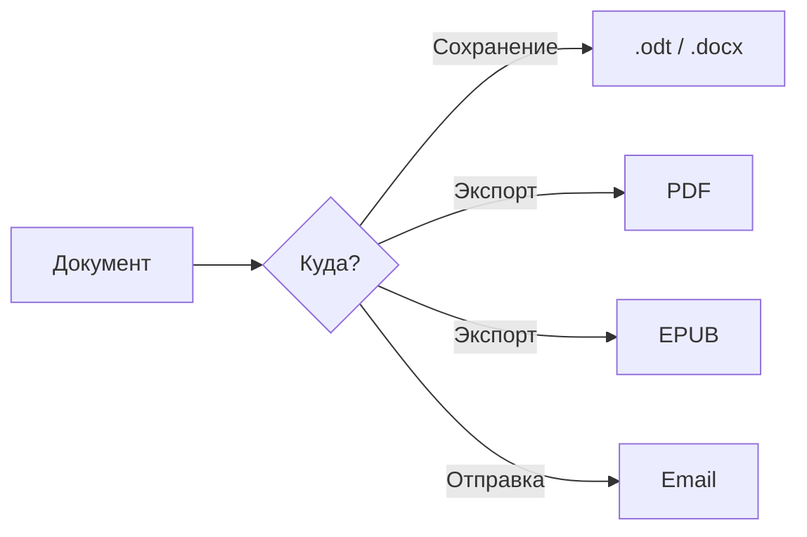

---
Здесь вы можете разместить содержимое вашей второй презентации. Это может быть текст, изображения, ссылки и любой другой поддерживаемый Markdown-контент.---
theme: default
title: Создание и редактирование текстового документа в LibreOffice Writer
info: |
  Учебная презентация по LibreOffice Writer
  Для Obsidian + Slidev
class: text-center
highlighter: shiki
drawings:
  persist: false
mdc: true
---

# Создание и редактирование текстового документа в LibreOffice Writer

## Полный курс за 2 часа

<div class="pt-12">
  <span class="px-2 py-1 rounded cursor-pointer" hover="bg-white bg-opacity-10">
    Нажмите пробел для навигации →
  </span>
</div>

---

# Что такое LibreOffice Writer?

<div class="grid grid-cols-2 gap-4">
<div>

- **Бесплатный** текстовый процессор
- Часть офисного пакета **LibreOffice**
- Поддерживает **.odt, .docx, .pdf, .rtf**
- **Открытый исходный код**
- Работает на **Windows, Linux, macOS**

</div>
<div>



</div>
</div>

---

# Интерфейс Writer

<div class="text-left">

```
┌─────────────────────────────────────────────┐
│  Заголовок окна / Title Bar                  │
├─────────────────────────────────────────────┤
│  Файл Правка Вид Вставка Формат ...          │
│  (File) (Edit) (View) (Insert) (Format)      │
├─────────────────────────────────────────────┤
│  [Стандартная панель / Standard Toolbar]     │
│  [Панель форматирования / Formatting Toolbar]│
├─────────────────────────────────────────────┤
│                                             │
│         Рабочая область / Document          │
│                                             │
│         ┌──────────────┐                    │
│         │ Боковая      │                    │
│         │ панель       │                    │
│         │ (Sidebar)    │                    │
│         └──────────────┘                    │
│                                             │
├─────────────────────────────────────────────┤
│  Строка состояния / Status Bar              │
└─────────────────────────────────────────────┘
```

</div>

---

# Создание документа

<div class="grid grid-cols-2 gap-4">
<div>

## Шаги:

1. **Ctrl+N** или **Файл → Создать** (File → New)
2. Ввести текст
3. **Ctrl+S** или **Файл → Сохранить** (File → Save)
4. Выбрать формат (**Odf Text Document .odt**)

</div>
<div>



</div>
</div>

---

# Редактирование: горячие клавиши

| Действие | Клавиши | English |
|----------|---------|---------|
| Выделить всё | **Ctrl+A** | Select All |
| Копировать | **Ctrl+C** | Copy |
| Вырезать | **Ctrl+X** | Cut |
| Вставить | **Ctrl+V** | Paste |
| Отменить | **Ctrl+Z** | Undo |
| Повторить | **Ctrl+Y** | Redo |
| Найти и заменить | **Ctrl+H** | Find & Replace |
| Проверка орфографии | **F7** | Spellcheck |

---

# Форматирование символов

<div class="grid grid-cols-2 gap-4">
<div>

### Панель форматирования:

- **Шрифт** (Font) — Calibri, Times New Roman...
- **Размер** (Size) — 8–72 pt
- **Жирный** (Bold) — **Ctrl+B**
- **Курсив** (Italic) — **Ctrl+I**
- **Подчёркнутый** (Underline) — **Ctrl+U**
- **Цвет** (Color)

</div>
<div>

```
┌──────────────────────────────────┐
│ Calibri ▼ │ 11 ▼ │ B │ I │ U │ A ▼│
└──────────────────────────────────┘
     ↑         ↑     ↑   ↑   ↑   ↑
  Шрифт    Размер  Жирн Курс Подч Цвет
 (Font)   (Size) (Bold)(Ital)(Und)(Color)
```

</div>
</div>

---

# Форматирование абзацев

<div class="grid grid-cols-2 gap-4">
<div>

- **Выравнивание** (Alignment): по левому краю (Left), по центру (Center), по правому (Right), по ширине (Justify)
- **Отступы** (Indents): первая строка, слева, справа
- **Интервалы** (Spacing): перед, после, между строками
- **Списки** (Lists): маркированные (Bullets), нумерованные (Numbering)

</div>
<div>



</div>
</div>

---

# Стили: главный принцип

> **Используйте стили, а не ручное форматирование!**

<div class="grid grid-cols-2 gap-4">
<div>

### Что даёт стиль?

- **Единообразие** документа
- **Лёгкость** изменения (поменяли стиль — изменилось всё)
- **Структура** документа (заголовки → оглавление)
- **Экспорт** в PDF/HTML с сохранением структуры

</div>
<div>



</div>
</div>

---

# Таблицы и изображения

<div class="grid grid-cols-2 gap-4">
<div>

### Таблицы

- **Ctrl+F12** или **Таблица → Вставить таблицу** (Table → Insert Table)
- Указать: столбцы (Columns), строки (Rows)
- Форматирование: границы (Borders), фон (Background)

### Изображения

- **Вставка → Изображение** (Insert → Image)
- Обтекание текстом (Text Wrapping)
- Привязка (Anchor)

</div>
<div>

```
┌──────────────────────────────┐
│  Вставка таблицы             │
│  Insert Table                │
│                              │
│  Столбцы / Columns: [ 3 ]    │
│  Строки / Rows:     [ 4 ]    │
│                              │
│  [OK]  [Cancel]              │
└──────────────────────────────┘
```

</div>
</div>

---

# Экспорт и сохранение

<div class="grid grid-cols-2 gap-4">
<div>

### Форматы сохранения:

- **.odt** — OpenDocument Text (по умолчанию)
- **.docx** — Microsoft Word
- **.pdf** — Portable Document Format
- **.epub** — электронная книга
- **.rtf** — Rich Text Format

### Экспорт:

- **Файл → Экспорт в PDF** (File → Export as PDF)
- **Файл → Отправить → Экспорт в EPUB** (File → Send → Export as EPUB)

</div>
<div>



</div>
</div>

---

# Итог

<div class="grid grid-cols-3 gap-4 text-center">

<div>

## 🎯 Создание

- Ctrl+N
- Ввод текста
- Ctrl+S

</div>

<div>

## ✏️ Редактирование

- Ctrl+C/V/X
- Ctrl+Z/Y
- Ctrl+H, F7

</div>

<div>

## 🎨 Форматирование

- Стили (Styles)
- Абзацы (Paragraphs)
- Списки (Lists)

</div>

</div>

---

# Спасибо за внимание!

<div class="pt-12">

## Вопросы?

</div>

<div class="abs-br m-6 text-xl">
  <a href="https://libreoffice.org" target="_blank" class="slidev-icon-btn">
    🌐 libreoffice.org
  </a>
</div>

<!--
Спикерские заметки для последнего слайда:
- Поблагодарить аудиторию
- Напомнить о домашнем задании
- Предложить задавать вопросы
- Указать, где найти материалы (Moodle, Obsidian vault)
-->
